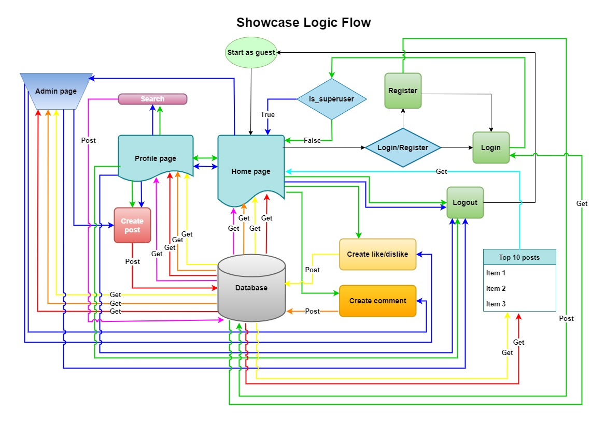
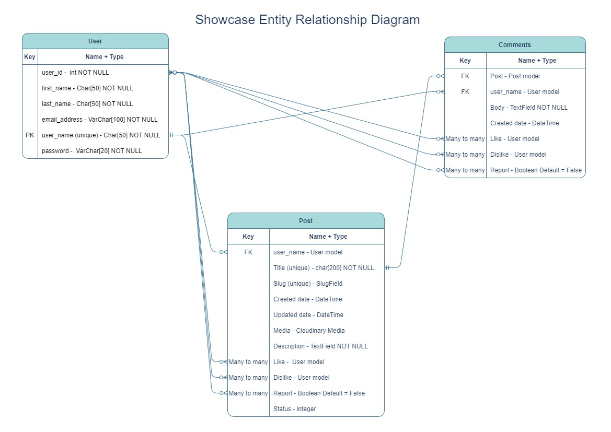

# SHOWCASE
Showcase is a platform for artists of all genres to showcase their talent to other artists and the wider public.

Users can upload images or videos along with a description or excerpt of their art and receive feedback from other users in the form of comments and/or likes.

Placeholder for responsive image

## User Experience (UX)
### User Stories

#### External User Goals:
* As a new user I would like to:
  * Be able to view content on the site without having to login.
  * Be able to search for content I'm interested in by:
    * Subject matter
    * Art form
    * Username
  * Be able to easily register to login to the site with a username, email and password to create a user profile.

* As a logged user I would like to:
  * Be able to easily login to the site.
  * Be able to see notifications of any unseen likes or comments made about my posts or comments.
  * Be able to see a list of the top posts on the home page rated by number of likes.
  * Be able to easily add a post with the following content:
    * A title
    * Art form
    * Image/s or video/s
    * A description of the content
  * Be able to edit a post or comment.
  * Be able to view my profile page containing any posts I have created and resulting comments and likes/dislikes.
  * Be able to view and add comments on posts.
  * Be able to comment on comments.
  * Be able to like or dislike a post.
  * Be able to like or dislike a comment.  
  * Be able to report a post or comment for inappropriate content.  
  * Be able to easily delete posts or comments.
  * Be able to easily delete my profile.
  * Be able to easily log out.

#### Site Owner Goals:
* As the site owner I would like to:
  * See notifications of any reported posts from the home screen.
  * Have easy access to the admin page.
  * Be able to send users direct messages to warn of inappropriate content breaches.
  * Be able to delete posts or comments.
  * Be able to block a user for a period of time.
  * Be able to delete a user profile and all posts and comments created by the user.

## Design (UXD)

### Strategy

#### Project Goal
Create a platform for artists to display their talent and receive feedback in the form of comments and likes.

* __Is the content culturally appropriate?__
  * Yes. All content is supplied by users.
* __Is the content relevant?__
  * Yes. The content supplied is specific to the site's goal.
* __Can we track and catalogue the content in an intuitive way?__
  * Yes. All content is stored in a database and is created using forms.
* __Is the technology appropriate?__
  * Yes. Django was designed for creating full stack sites and apps.
* __Why are we so special? What sets us appart?__
  * Most artists tend to use social media to display their work, this platform is specifically designed for artists and clients that appreciate the content of the site.
* __Tech considerations?__
  * The site will be built with Python + Django, using class based views, HTML templates, Bootstrap to handle responsiveness and styling, CSS to handle custom styling, JavaScript to handle timeout functions and CDNs, and PostgreSQL for the database. 
* __Why would a user want this?__
  * Users would want to use this site to get useful and relevant feedback about their work from like minded people.

### Scope

* __What does the user want to accomplish?__
  * The user wants to display their work on a platform specifically designed for artists and receive relevant and constructive feedback from like minded people.
* __What does the user need to do in order to achieve their objective?__
  * The user needs to register and login to the site to give them access to a profile page from which they can create posts and comment on other user's posts.
* __What constraints does the site or app has to conform within?__
  * A limited build time.
* __What dynamic constraints do we have to meet?__
  * Ensure innapropriate content is dealt with swiftly by use of the 'Report' procedure.

#### **Functional Scope**

The following diagrams were created on [diagrams.net](https://app.diagrams.net).

Logic Flowchart

Entity Relationship Diagram

#### **Agile Methodology**
 
All development of this project was managed using the Project and issues features of [GitHub](https://github.com), which can be viewed [here](https://github.com/mwarddev/showcase/projects/1).

## Structure

* Using a simple straight forward layout, users will easily be able to navigate to their desired content.
* A fixed navigation bar at the top of the page will enable easy navigation and the ability to register/login or logout.
* From the home page, users can navigate content by art form, view a top 10 list of the site's most popular posts, search for content and navigate to their profile page.
* From their profile page, users can view a timeline list of their posts, update/delete their posts and create new posts.
* When viewing another user's post, users can like/dislike the post, comment on the post, reply to another user's comment and like/dislike another user's comment. Comments and posts can also be reported if the content is deemed inappropriate.
* Clicking on another user's name anywhere on the site will navigate to that user's profile page to view all content by that user.

## Skeleton

It is likely that most users would use this site on a mobile device due to camera fucionality, and with this in mind the site has been designed with a mobile first perspective.

Wireframe layouts for the site were created using [balsamiq](https://balsamiq.com/).
View the wireframes [here](readme-images/showcase_wireframes.pdf).

## Surface

