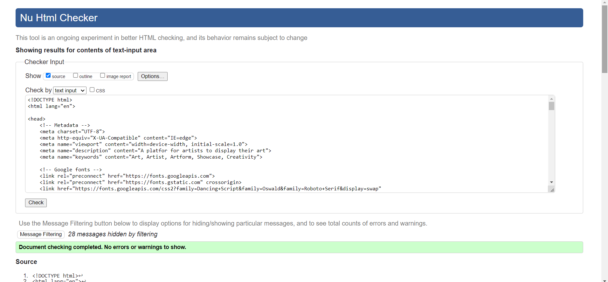
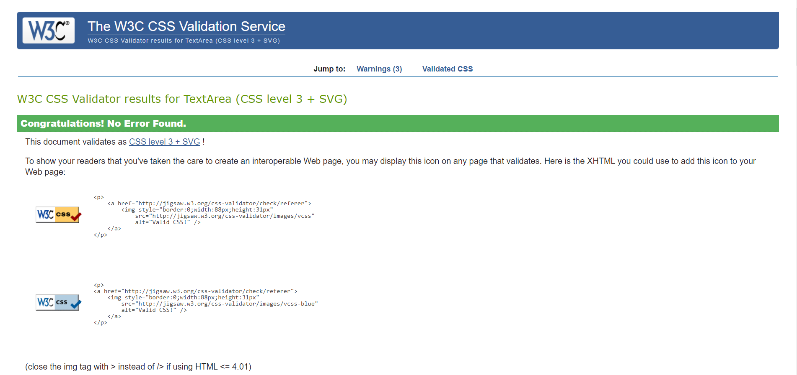
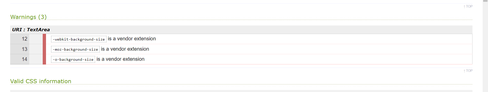
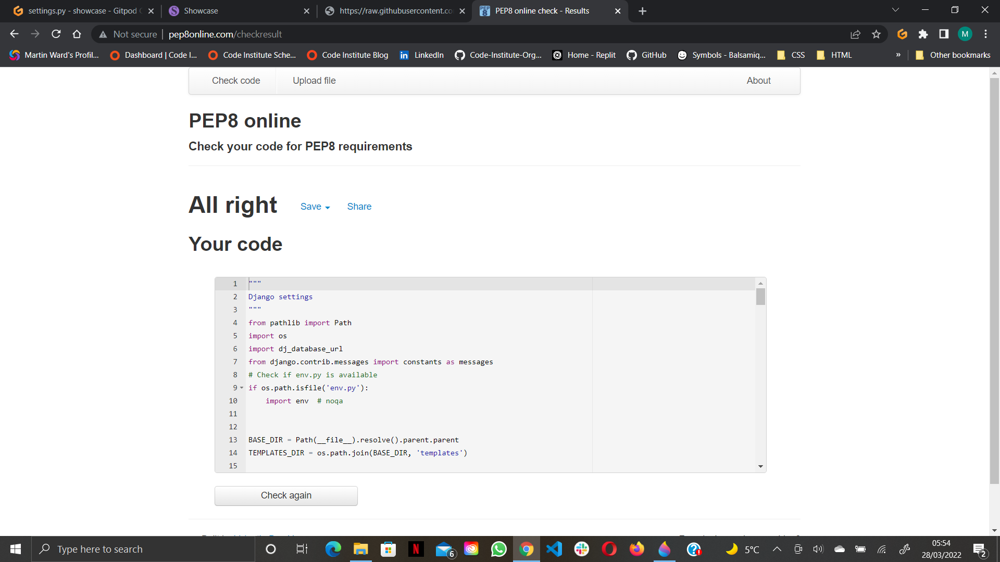
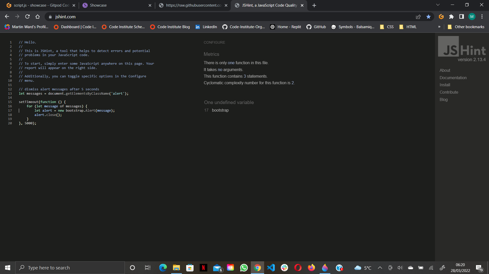
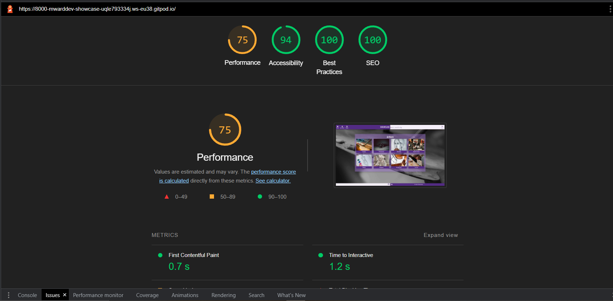
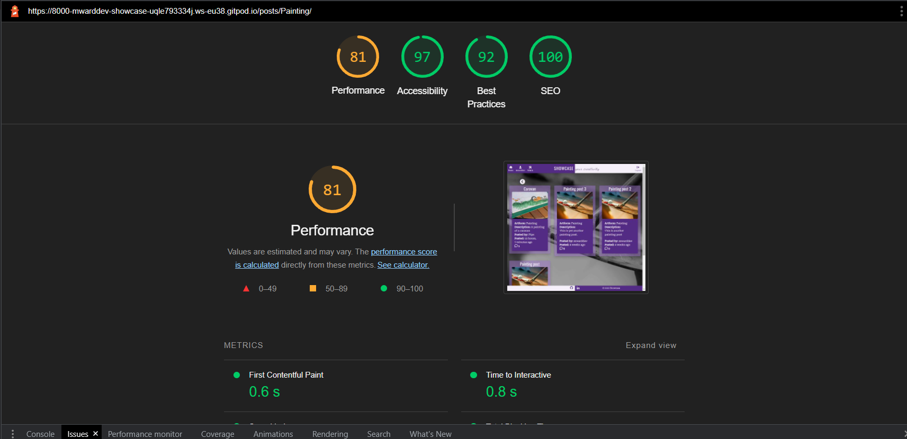
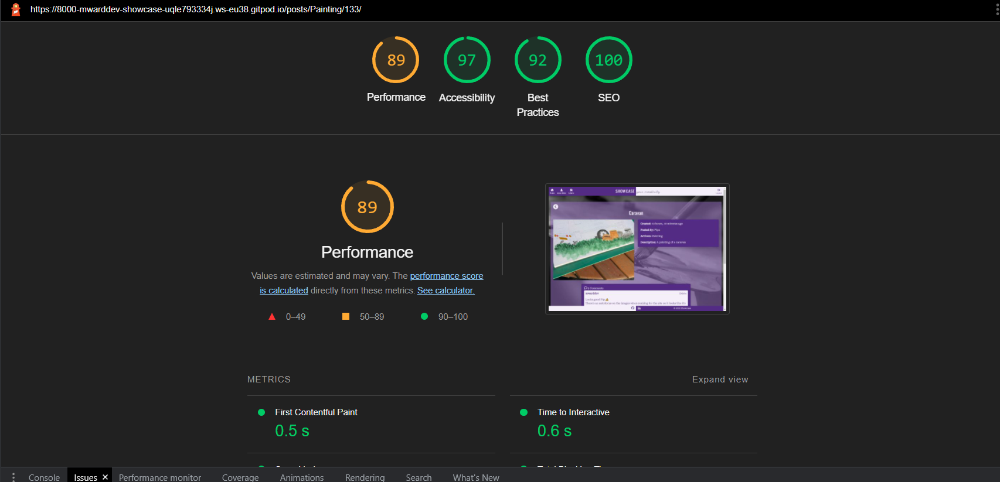
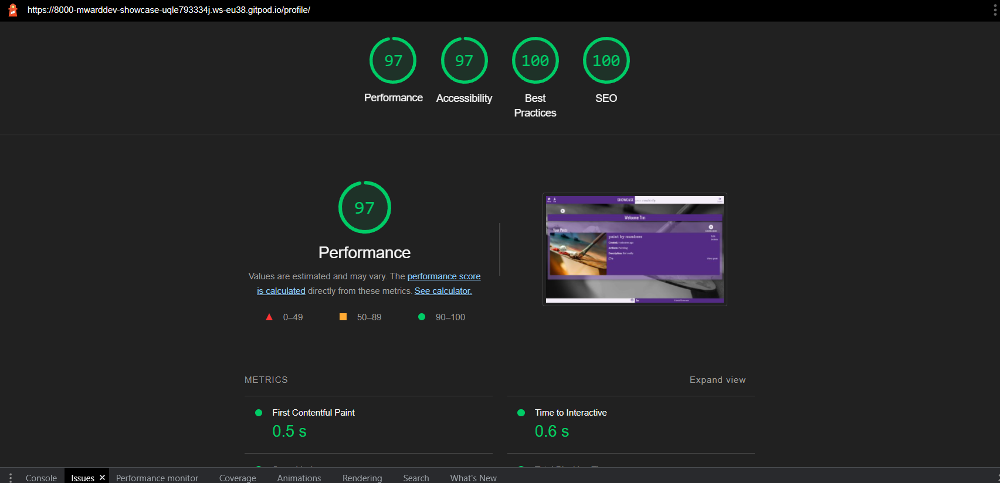

# SHOWCASE
Showcase is a platform for artists of all genres to showcase their talent to other artists and the wider public.

Users can upload images along with a description or excerpt of their art and receive feedback from other users in the form of comments.


View the live site [here](https://showcase2022.herokuapp.com/).

Please feel free to sign up and **Showcase** your artistic talent.

## Contents

* [User Experience (UX)](#user-experience-ux)
  * [User Stories](#user-stories)
    * [External User Goals](#external-user-goals)
    * [Site Owner Goals](#site-owner-goals)
* [Design (UXD)](#design-uxd)
  * [Strategy](#strategy)
    * [Project Goal](#project-goal)
  * [Scope](#scope)
    * [Functional Scope](#functional-scope)
    * [Agile Methodology](#agile-methodology)
  * [Structure](#structure)
  * [Skeleton](#skeleton)
  * [Surface](#surface)
    * [Colour Palette](#colour-palette)
    * [Typography](#typography)
    * [Iconography](#iconography)
* [Features](#features)
  * [Existing Features](#existing-features)
  * [Future Features](#future-features)
* [Technologies Used](#technologies-used)
* [Testing](#testing)
  * [Manual Tests](#manual-tests)
  * [Validator Testing](#validator-testing)
  * [Bugs & Fixes](#bugs--fixes)
* [Deployment](#deployment)
* [Credits](#credits)
* [Aknowledgements](#aknowledgements)


## User Experience (UX)
### User Stories

#### External User Goals:
* As a new user I would like to:
  * Be able to view content on the site without having to login.
  * Be able to search for content I'm interested in by:
    * Subject matter
    * Art form
    * Username
  * Be able to easily register to login to the site with a username, email and password to create a user profile.

* As a logged user I would like to:
  * Be able to easily login to the site.
  * Be able to see notifications of any unseen likes or comments made about my posts.
  * Be able to see a list of the top posts on the home page rated by number of likes.
  * Be able to easily add a post with the following content:
    * A title
    * Art form
    * Image/s or video/s
    * A description of the content
  * Be able to edit my posts.
  * Be able to view my profile page containing any posts I have created and resulting comments and likes/dislikes.
  * Be able to view and add comments on posts.
  * Be able to edit my comment after submission.
  * Be able to like or dislike a post.
  * Be able to like or dislike a comment.  
  * Be able to report a post or comment for inappropriate content.  
  * Be able to easily delete posts or comments.
  * Be able to easily delete my profile.
  * Be able to easily log out.

#### Site Owner Goals:
* As the site owner I would like to:
  * See notifications of any reported posts from the home screen.
  * Have easy access to the admin page.
  * Be able to send users direct messages to warn of inappropriate content breaches.
  * Be able to delete posts or comments.
  * Be able to block a user for a period of time.
  * Be able to delete a user profile and all posts and comments created by the user.

## Design (UXD)

### Strategy

#### Project Goal
Create a platform for artists to display their talent and receive feedback in the form of comments and likes.

* __Is the content culturally appropriate?__
  * Yes. All content is supplied by users.
* __Is the content relevant?__
  * Yes. The content supplied is specific to the site's goal.
* __Can we track and catalogue the content in an intuitive way?__
  * Yes. All content is stored in a database and is created using forms.
* __Is the technology appropriate?__
  * Yes. Django was designed for creating full stack sites and apps.
* __Why are we so special? What sets us appart?__
  * Most artists tend to use social media to display their work, this platform is specifically designed for artists and clients that appreciate the content of the site.
* __Tech considerations?__
  * The site will be built with Python + Django, using class based views, HTML templates, Bootstrap to handle responsiveness and styling, CSS to handle custom styling, JavaScript to handle timeout functions and CDNs, and PostgreSQL for the database. 
* __Why would a user want this?__
  * Users would want to use this site to get useful and relevant feedback about their work from like minded people.

### Scope

* __What does the user want to accomplish?__
  * The user wants to display their work on a platform specifically designed for artists and receive relevant and constructive feedback from like minded people.
* __What does the user need to do in order to achieve their objective?__
  * The user needs to register and login to the site to give them access to a profile page from which they can create posts and comment on other user's posts.
* __What constraints does the site or app has to conform within?__
  * A limited build time.
* __What dynamic constraints do we have to meet?__
  * Ensure innapropriate content is dealt with swiftly by use of the 'Report' procedure.

#### **Functional Scope**

The following diagrams were created on [diagrams.net](https://app.diagrams.net).

Logic Flowchart


Entity Relationship Diagram


#### **Agile Methodology**
 
All development of this project was managed using the Project and issues features of [GitHub](https://github.com), which can be viewed [here](https://github.com/mwarddev/showcase/projects/1).

### Structure

* Using a simple straight forward layout, users will easily be able to navigate to their desired content.
* A fixed navigation bar at the top of the page will enable easy navigation and the ability to register/login or logout.
* From the home page, users can navigate content by art form, view a top 10 list of the site's most popular posts, search for content and navigate to their profile page.
* From their profile page, users can view a timeline list of their posts, update/delete their posts and create new posts.
* When viewing another user's post, users can like/dislike the post, comment on the post, reply to another user's comment and like/dislike another user's comment. Comments and posts can also be reported if the content is deemed inappropriate.
* Clicking on another user's name anywhere on the site will navigate to that user's profile page to view all content by that user.

### Skeleton

It is likely that most users would use this site on a mobile device due to camera fucionality, and with this in mind the site has been designed with a mobile first perspective.

Wireframe layouts for the site were created using [balsamiq](https://balsamiq.com/).
View the wireframes [here](readme-images/showcase_wireframes.pdf).

### Surface

The colour scheme for the site needs to be visually appealing without taking ephasis away from the posted art. Using a small colour palette should help with this.

#### Colour Palette


This colour palette was obtained from [coolors.co](https://coolors.co/).

#### Typography

All fonts have been imported from [Google Fonts](https://fonts.google.com/).

For titles and subtitles the Oswald and Dancing Script fonts have been used and the Roboto Serif font for all other text.

#### Iconography

The favicon  was created with a simple paint application.

All other icons were obtained from [Fontawesome](https://fontawesome.com/).

## Features

### Existing Features

#### Navbar


The navbar is dynamic depending on whether a user is logged in or not, the access level of the user and the width of the screen.

Links are depicted as icons with text definition on larger screens and without text on smaller screens. The depicted navbar is rendered if the user is not logged in.

The icon links from left to right are, the home link (redirects to the home page), the center logo (redirects to the home page), register link (redirects to a sign up form), login link (redirects to the login form).

The navbar is fixed in place and is visible on every page.

#### Home Page


The home page consists of a list of cards depicting different forms of art. Clicking on one of these cards directs the user to a list of posts relating to the artform selected. Unregistered users are able to view this page.

#### Footer


The footer simply consists of 2 nav links. One links to the github repo for the site, the other links to the developer's Linkedin page. Both links open in an external window. In the purple section the user can find copyright info.

#### Sign Up Form


The sign up form is provided by [Django Allauth](https://django-allauth.readthedocs.io/en/latest/) which handles all the user authorizations for the site. To register for the site a potential user only needs to provide a username, and a password. Providing an email address is optional but not required.

Once the user is registered and logged in, a profile icon appears on the navbar next to the home icon.

#### Login Form


The login/sign in form is also provided by [Django Allauth](https://django-allauth.readthedocs.io/en/latest/) and requires the user's username and password to access the site. where the user will be able to create, edit and delete posts and create and delete comments.

#### Logged in Home page


The only differences on the logged in page are the icons on the navbar. The profile icon appears with the user's username underneath. The site administrator has an extra icon wich gives access to site administrator page. The register and login icons are removed and replaced with a logout icon.

#### Artform Post List Page


When an artform is selected on the home page the user is directed to this post list page containing all the posts created of that paricular artform. The post cards are arranged in order of creation and contain a preview image (if, for some reason, the user dosen't provide an image a placeholder image is used instead), the artform type, a snippet of the post's description, the post's creator, how long ago it was posted and the comment count. Non-registered users can also view this page. Clicking on a card will direct the user to the full post page.The back button takes the user back to the home page.

#### Full Post Page


In the full post page the user can find a larger post image (larger screens) and the full post description.


Scrolling down the page the user will find a comment section in which they'll be able to view comments, the number of comments posted, and post their own comment if they wish. the user also has the option to delete their comments.
Non-registered users will only be able to view comments with on interaction.
Clicking the back button at the top of the page will take the user back to the post list page. Or, if the user is the owner of the post, they'll be redirected to their profile page.

#### Profile Page


Clicking on the user profile icon in the navbar (not available to non-registered users), the user will be taken to their user profile page where they'll be able to take full advantage of the site's CRUD functionality. They'll be able to: 
* Create a new post by clicking the create a new post icon
* Read, the user will see a list of their posts in preview form and can see their full post by clicking the View full post link in the post's info box 
* Update a post by clicking on the edit link of the required post
* Delete a post by clicking on the delete link of the required post

The post info box also contains a comment counter.
Clicking the back button takes the user back to the home page.

#### Create a Post


Clicking on the create a post button in the profile page, the user is directed to the Create a New Post form page. The form was created using [Django Crispy Forms](https://django-crispy-forms.readthedocs.io/en/latest/) and requests the user selects an artform (default is Painting), a title for the post, a description of the artform they have created, and an image (default image is used if one isn't uploaded). The uploaded images are stored on [cloudinary.com](https://cloudinary.com/). Once submitted, the user is redirected back to their profile page. 

#### Edit a Post


The edit link takes the user to and edit form page, which is much the same as the create form page except the form is pre-filled with the post's information. The user is able to change any aspect of the form (even the image), and save the changes by clicking the update button at the bottom of the form. The user will then be redirected to their profile page.

#### Delete a Post


The delete link takes the user to a confirmation page where they're asked if they're sure they want to delete the post. If they click yes, the post is deleted along with all comments relating to the post and the user is redirected back to their profile page. If they click no, they're redirected back to their profile page and the post remains on the site.

### Future Features

* User authentication
  * More information to be taken at registration in order to provide more features, such as email contact and a more personalised profile page.
  * Forgotten password form.
* Search button to find posts by keywords, username, artform.
* Ability to upload multiple pictures per post.
* Ability to upload videos so artforms such as music can be included.
* Ability to like and dislike a post.
  * View likes and dislikes on a post to see popularity.
  * Top 10 posts list on homepage calculated by subtracting dislikes from likes to give an overall post score.
* Ability to edit a comment incase of a mistake made when originally posting.
* Edit personal information in profile page.
* Direct messaging with other users.

## Technologies Used

Python 3.8,
HTML,
CSS,
JS

### Frameworks, Libraries and programs Used

* Django 4, the main framework of the site
* Bootstrap 5, the main souce of styling for the site
* Git, used for version control
* GitHub, used to store the repository
* Heroku, used to deploy the site
* Cloudinary, used to upload site images and static files for the site
* Django Allauth, used for authorizations and user info validation
* Django Crispy Forms, used to create forms on the site
* Django Summernote, used as the text editor for the main body of text in creating posts
* PostgeSQL, the database used to store all user and post information for the site


## Testing

The site has been tested on a variety of devices and platforms by a group of peers.

### Manual tests

#### Home Page

| Test | Result |
| --- | --- |
| Home page renders as expected on all screen sizes and mobile/ tablet orientation | Yes |
| User able to select a category | Yes |
| Register form renders correctly when clicked | Yes |
| User able to register for the site | Yes |
| Required fields work as expected | Yes |
| Login form renders correctly | Yes |
| User able to successfully login | Yes |
| Required fields work as expected | Yes |
| User receives alert message to confirm successful login | Yes |
| Alert message automatically dismisses after 5 seconds | Yes |
| Home, User profile, and logout icons visible in navbar on login | Yes |
| User able to click footer links which open in a new window | Yes |
| Admin icon appears in navbar if user is superuser | Yes |
| Admin icon directs user to the admin page/site in a new window | Yes | 

#### Post List Page

| Test | Results |
| --- | --- |
| Page renders as expected on all screen sizes and mobile/ tablet orientation | Yes |
| Back button renders on page correctly and redirects user back to the home page | Yes |
| Post list preview cards render on page for selected category | Yes |
| Post cards display image preview, post info and comment count | Yes |
| User redirected to full post page when post card is clicked | Yes |
| Unregistered user redirected to full post page when post card is clicked | Yes |

#### Full Post Page

| Test | Results |
| --- | --- |
| Page renders as expected on all screen sizes and mobile/ tablet orientation | Yes |
| Back button renders on page correctly and redirects user back to the post list page or if user is the post owner, back to the user profile page | Yes |
| Post image, information and comment section rendered correctly | Yes |
| Comment count visible and correct at top of comment section | Yes |
| All comments visible to all users | Yes |
| Comment form visible to registered users and not unregistered users | Yes |
| Registered user able to compose a comment and submit the form | Yes |
| Registered user's comment renders in the comment section and comment count updates | Yes |
| Delete link visible on registered user's comment and not other user's comments | Yes |
| Registered user redirected to comment delete confirmation form when delete link clicked | Yes |
| Registered user redirected to full post page if "No" clicked and comment still visible | yes |
| Registered user redirected back to full post page if "Yes" clicked and comment not visible and comment counter updated | Yes |
| Success alert message rendered to page for the above 2 tests | Yes |

#### Profile Page

| Test | Results |
| --- | --- |
| Registerd user redirected to their user profile page when profile icon clicked in navbar | Yes |
| Page renders as expected on all screen sizes and mobile/ tablet orientation | Yes |
| Back button renders correctly and redirects registered user back to the home page | Yes |
| Welcome message renders correctly, welcoming the user by their username | Yes |
| Create a post button redirects the user to the create post form when clicked | Yes |
| User able to populate the form and upload an image successfully | Yes |
| On submitting the form the user is redirected back to their profile page | Yes |
| Clicking the back button on the form page redirects the user back to their preofile page | Yes |
| Clicking the reset button on the form clears all form data | Yes |
| On form submission the new post is rendered at the top of the user's post list on the profile page | Yes |
| A preview card list of the user's posts visible with an image and post information visible for each post | Yes |
| Post edit link visible on each post preview card and redirects the user to the edit post form | Yes |
| Back button on the post edit form page redirects back to the user's profile page | Yes |
| Post edit form pre-populated with post's data | Yes |
| User able to edit data and resubmit the form | Yes |
| User redirected back to profile page on submission | Yes |
| Updated info displaying the the post preview list | Yes |
| Delete link visible for each post in user's post list | Yes |
| User redirected to post delete confirmation form when delete link clicked | Yes |
| User redirected back to profile page if "No" is clicked and post still visible in post list | Yes |
| User redirected back to profile page if "Yes" clicked and post deleted from the post list | Yes |
| Delete success alert message visible after form submission | Yes |
| view post link visible on each post in the user's post list | Yes |
| View post link redirects the user to the post's full post page | Yes |
| Full post page contains any post edits made by the user | Yes |
| On deletion of a post, all related comments are deleted with it | Yes |

#### Logout

| Test | Results |
| --- | --- |
| User redirected to the logout confirmation page when logout icon clicked | Yes |
| User redirected back to the home screen when logout form submitted | Yes |
| Logout success alert message displayed on user logout | Yes |

### Validatior Testing

#### Markup
HTML docs were run through the W3C Markup validation service with only bootstrap related errors which can be ignored. 

base.html


[index.html](readme-images/validator/index.png),
[posts.html](readme-images/validator/posts.png),
[full-post.html](readme-images/validator/full-post.png),
[profile.html](readme-images/validator/profile.png),
[new-post.html](readme-images/validator/new-post.png),
[edit-post.html](readme-images/validator/edit-post.png),
[delete-post.html](readme-images/validator/delete-post.png),
[add-comment.html](readme-images/validator/add-comment.png),
[delete-comment.html](readme-images/validator/delete-comment.png)

#### CSS
CSS code was run through the W3C CSS Jigsaw validator with no errors and 3 warnings for vendor extensions.




#### PEP8

All python files were run through an online PEP8 linter with no errors.

settings.py


[home-view](readme-images/validator/pep8/home-view.png),
[home-urls](readme-images/validator/pep8/home-urls.png),
[exhibition-views](readme-images/validator/pep8/exhibition-views.png),
[exhibition-urls](readme-images/validator/pep8/exhibition-urls.png),
[exhibition-models](readme-images/validator/pep8/exhibition-models.png),
[exhibition-admin](readme-images/validator/pep8/exhibition-admin.png),
[create-views](readme-images/validator/pep8/create-views.png),
[create-urls](readme-images/validator/pep8/create-urls.png),
[create-forms](readme-images/validator/pep8/create-forms.png),
[comments-models](readme-images/validator/pep8/comments-models.png),
[comments-forms](readme-images/validator/pep8/comments-forms.png),
[comments-admin](readme-images/validator/pep8/comments-admin.png)

#### JavaScript

JavaScript code was run through the Jshint validator with only 1 undefined variable "bootstrap". This can be ignored.



#### Lighthouse

Lighthouse was run on the main 4 pages and revealed performance loss depending on how many images are rendered on the page. To combat this, all static images have been run through [tinypng.com](https://tinypng.com/) to reduce image sizes.

Home Page



Posts Page



Full Post Page



Profile Page



### Bugs & Fixes

| Bug | Fix |
| --- | --- |
| Static images not showing in deployed site. Images were being called from a local file | Images were being called in a for loop pairing the image name with it's category name in the site. A new list was created with the key being the category name to pair with the category name of the first list, and the value being the filepath of the associated image. The background image in the css file however still wasn't working so it had to be changed to an [inline style](readme-images/bugs/inline-bg.png), which, paired with bootstrap commands, doesn't look pretty but it works |
| User unable to login if they didn't register an email address when signing up [connection-refused](readme-images/bugs/connection-refused.png) | Validator setting entered into settings.py to override the required attribute |
| Console.log [error](readme-images/bugs/js-error.png) for timeout function on bootstrap alert messages | Function adjusted to iterate over the messages instead of all of them |

## Deployment

After setting up the local environment by installing all require frameworks and libraries, take the following steps:

* Create a requirements.txt by running
```
pip3 freeze --local > requirements.txt
```
* Create a Procfile containing the following code:
```
web: gunicorn showcase.wsgi
```
* Sign up to heroku then create a new app
* Choose a unique app name and set your location
* Click on the "Resources" tab and search for postgres then select Heroku Postgres
* Click on the "Deploy" tab and choose to connect with GitHub
* Once connected with GitHub, choose your project repo from a list or search for your repo and select it.
* Click on the "Settings" tab then click "Config Vars"
* Insert your Cloudinary url in the Key, Value boxes, then your database url and your secret key
* Click on the "Deploy" tab again, then choose the main branch for your GitHub repo
* Select Enable automatic deploys to deploy the site every time you commit and push your code to your repo
* Click "Deploy branch" and when the build is finished click on "View site". The site has been deployed


## Credits

My main source of information for this project came from the Codeinstitute Django blog walkthrough project.

Other sources of informtion were:
* My mentor tim_ci
* Django docs 
* Bootstrap docs
* Stackoverflow
* Snippets from various youtube videos

All static images were taken from the royalty free website [pexels.com](https://www.pexels.com/) and are attributed to the following photographers:

| Image | Photographer |
| --- | --- |
| [shallow-focus-photography-of-paintbrush](https://www.pexels.com/photo/shallow-focus-photography-of-paintbrush-102127/) | [Daian Gan](https://www.pexels.com/@daiangan) |
| [aperture-black-blur-camera](https://www.pexels.com/photo/aperture-black-blur-camera-274973/) | [Pixabay](https://www.pexels.com/@pixabay) |
| [posters-on-wall](https://www.pexels.com/photo/posters-on-wall-3052727/) | [Jonathan Borba](https://www.pexels.com/@jonathanborba) |
| [crop-artist-creating-clay-sculpture](https://www.pexels.com/photo/crop-artist-creating-clay-sculpture-6598664/) | [Sunsetoned](https://www.pexels.com/@sunsetoned) |
| [architectural-photography-of-brown-wooden-stairs](https://www.pexels.com/photo/architectural-photography-of-brown-wooden-stairs-3153679/) | [Akwice](https://www.pexels.com/@akwice) |
| [a-person-doing-carpentry](https://www.pexels.com/photo/a-person-doing-carpentry-6790088/) | [Tima Miroshnichenko](https://www.pexels.com/@tima-miroshnichenko) |
| [a-person-holding-white-printer-paper](https://www.pexels.com/photo/a-person-holding-white-printer-paper-7761829/) | [Ron Lach](https://www.pexels.com/@ron-lach) |
| [crop-person-drawing-female-portrait-with-pencil](https://www.pexels.com/photo/crop-person-drawing-female-portrait-with-pencil-4752046/) | [igovar](https://www.pexels.com/@igovar-3000547)

## Aknowledgements

I would like to give a special thank you to my friends and family for helping to keep me sane whilst working on this project.

My mentor for giving me a push in the right direction.

My daughter, Annabella for choosing the colour scheme.


