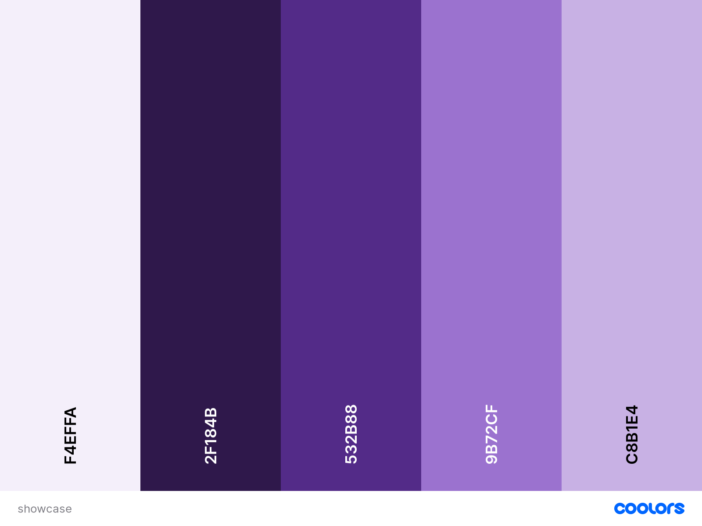

# SHOWCASE
Showcase is a platform for artists of all genres to showcase their talent to other artists and the wider public.

Users can upload images along with a description or excerpt of their art and receive feedback from other users in the form of comments.

View the live site [here](https://showcase2022.herokuapp.com/).

Please feel free to sign up and **Showcase** your artistic talent.

## Contents

* [User Experience (UX)](#user-experience-ux)
  * [User Stories](#user-stories)
    * [External User Goals](#external-user-goals)
    * [Site Owner Goals](#site-owner-goals)
* [Design (UXD)](#design-uxd)
  * [Strategy](#strategy)
    * [Project Goal](#project-goal)
  * [Scope](#scope)
    * [Functional Scope](#functional-scope)
    * [Agile Methodology](#agile-methodology)
  * [Structure](#structure)
  * [Skeleton](#skeleton)
  * [Surface](#surface)
    * [Colour Palette](#colour-palette)
    * [Typography](#typography)
    * [Iconography](#iconography)
* [Features](#features)
  * [Existing Features](#existing-features)
  * [Future Features](#future-features)

  

## User Experience (UX)
### User Stories

#### External User Goals:
* As a new user I would like to:
  * Be able to view content on the site without having to login.
  * Be able to search for content I'm interested in by:
    * Subject matter
    * Art form
    * Username
  * Be able to easily register to login to the site with a username, email and password to create a user profile.

* As a logged user I would like to:
  * Be able to easily login to the site.
  * Be able to see notifications of any unseen likes or comments made about my posts.
  * Be able to see a list of the top posts on the home page rated by number of likes.
  * Be able to easily add a post with the following content:
    * A title
    * Art form
    * Image/s or video/s
    * A description of the content
  * Be able to edit my posts.
  * Be able to view my profile page containing any posts I have created and resulting comments and likes/dislikes.
  * Be able to view and add comments on posts.
  * Be able to edit my comment after submission.
  * Be able to like or dislike a post.
  * Be able to like or dislike a comment.  
  * Be able to report a post or comment for inappropriate content.  
  * Be able to easily delete posts or comments.
  * Be able to easily delete my profile.
  * Be able to easily log out.

#### Site Owner Goals:
* As the site owner I would like to:
  * See notifications of any reported posts from the home screen.
  * Have easy access to the admin page.
  * Be able to send users direct messages to warn of inappropriate content breaches.
  * Be able to delete posts or comments.
  * Be able to block a user for a period of time.
  * Be able to delete a user profile and all posts and comments created by the user.

## Design (UXD)

### Strategy

#### Project Goal
Create a platform for artists to display their talent and receive feedback in the form of comments and likes.

* __Is the content culturally appropriate?__
  * Yes. All content is supplied by users.
* __Is the content relevant?__
  * Yes. The content supplied is specific to the site's goal.
* __Can we track and catalogue the content in an intuitive way?__
  * Yes. All content is stored in a database and is created using forms.
* __Is the technology appropriate?__
  * Yes. Django was designed for creating full stack sites and apps.
* __Why are we so special? What sets us appart?__
  * Most artists tend to use social media to display their work, this platform is specifically designed for artists and clients that appreciate the content of the site.
* __Tech considerations?__
  * The site will be built with Python + Django, using class based views, HTML templates, Bootstrap to handle responsiveness and styling, CSS to handle custom styling, JavaScript to handle timeout functions and CDNs, and PostgreSQL for the database. 
* __Why would a user want this?__
  * Users would want to use this site to get useful and relevant feedback about their work from like minded people.

### Scope

* __What does the user want to accomplish?__
  * The user wants to display their work on a platform specifically designed for artists and receive relevant and constructive feedback from like minded people.
* __What does the user need to do in order to achieve their objective?__
  * The user needs to register and login to the site to give them access to a profile page from which they can create posts and comment on other user's posts.
* __What constraints does the site or app has to conform within?__
  * A limited build time.
* __What dynamic constraints do we have to meet?__
  * Ensure innapropriate content is dealt with swiftly by use of the 'Report' procedure.

#### **Functional Scope**

The following diagrams were created on [diagrams.net](https://app.diagrams.net).

Logic Flowchart

Entity Relationship Diagram

#### **Agile Methodology**
 
All development of this project was managed using the Project and issues features of [GitHub](https://github.com), which can be viewed [here](https://github.com/mwarddev/showcase/projects/1).

### Structure

* Using a simple straight forward layout, users will easily be able to navigate to their desired content.
* A fixed navigation bar at the top of the page will enable easy navigation and the ability to register/login or logout.
* From the home page, users can navigate content by art form, view a top 10 list of the site's most popular posts, search for content and navigate to their profile page.
* From their profile page, users can view a timeline list of their posts, update/delete their posts and create new posts.
* When viewing another user's post, users can like/dislike the post, comment on the post, reply to another user's comment and like/dislike another user's comment. Comments and posts can also be reported if the content is deemed inappropriate.
* Clicking on another user's name anywhere on the site will navigate to that user's profile page to view all content by that user.

### Skeleton

It is likely that most users would use this site on a mobile device due to camera fucionality, and with this in mind the site has been designed with a mobile first perspective.

Wireframe layouts for the site were created using [balsamiq](https://balsamiq.com/).
View the wireframes [here](readme-images/showcase_wireframes.pdf).

### Surface

The colour scheme for the site needs to be visually appealing without taking ephasis away from the posted art. Using a small colour palette should help with this.

#### Colour Palette

This colour palette was obtained from [coolors.co](https://coolors.co/).

#### Typography

All fonts have been imported from [Google Fonts](https://fonts.google.com/).

For titles and subtitles the Oswald and Dancing Script fonts have been used and the Roboto Serif font for all other text.

#### Iconography

The favicon  was created with a simple paint application.

All other icons were obtained from [Fontawesome](https://fontawesome.com/).

## Features

### Existing Features

#### Navbar

The navbar is dynamic depending on whether a user is logged in or not, the access level of the user and the width of the screen.

Links are depicted as icons with text definition on larger screens and without text on smaller screens. The depicted navbar is rendered if the user is not logged in.

The icon links from left to right are, the home link (redirects to the home page), the center logo (redirects to the home page), register link (redirects to a sign up form), login link (redirects to the login form).

The navbar is fixed in place and is visible on every page.

#### Home Page

The home page consists of a list of cards depicting different forms of art. Clicking on one of these cards directs the user to a list of posts relating to the artform selected. Unregistered users are able to view this page.

#### Footer

The footer simply consists of 2 nav links. One links to the github repo for the site, the other links to the developer's Linkedin page. Both links open in an external window. In the purple section the user can find copyright info.

#### Sign Up Form

The sign up form is provided by [Django Allauth](https://django-allauth.readthedocs.io/en/latest/) which handles all the user authorizations for the site. To register for the site a potential user only needs to provide a username, and a password. Providing an email address is optional but not required.

Once the user is registered and logged in, a profile icon appears on the navbar next to the home icon.

#### Login Form

The login/sign in form is also provided by [Django Allauth](https://django-allauth.readthedocs.io/en/latest/) and requires the user's username and password to access the site. where the user will be able to create, edit and delete posts and create and delete comments.

#### Logged in Home page

The only differences on the logged in page are the icons on the navbar. The profile icon appears with the user's username underneath. The site administrator has an extra icon wich gives access to site administrator page. The register and login icons are removed and replaced with a logout icon.

#### Artform Post List Page

When an artform is selected on the home page the user is directed to this post list page containing all the posts created of that paricular artform. The post cards are arranged in order of creation and contain a preview image (if, for some reason, the user dosen't provide an image a placeholder image is used instead), the artform type, a snippet of the post's description, the post's creator, how long ago it was posted and the comment count. Non-registered users can also view this page. Clicking on a card will direct the user to the full post page.The back button takes the user back to the home page.

#### Full Post Page

In the full post page the user can find a larger post image (larger screens) and the full post description. Unregistered users can view this page but not interact with it. If the content of the post is deemed to be unsuitable or offends the user in any way, there is a Report link on the description box which redirects the user to a form to report the post. This feature is not available to the original poster for obvious reasons. It's also not available to unregistered users.

Scrolling down the page the user will find a comment section in which they'll be able to view comments, the number of comments posted, and post their own comment if they wish. the user also has the option to delete their comments and, again, if another comment is deemed to be offensive it can be reported to admin.
Non-registered users will only be able to view comments with on interaction.
Clicking the back button at the top of the page will take the user back to the post list page. Or, if the user is the owner of the post, they'll be redirected to their profile page.

#### Profile Page

Clicking on the user profile icon in the navbar (not available to non-registered users), the user will be taken to their user profile page where they'll be able to take full advantage of the site's CRUD functionality. They'll be able to: 
* Create a new post by clicking the create a new post icon
* Read, the user will see a list of their posts in preview form and can see their full post by clicking the View full post link in the post's info box 
* Update a post by clicking on the edit link of the required post
* Delete a post by clicking on the delete link of the required post

The post info box also contains a comment counter.
Clicking the back button takes the user back to the home page.

#### Create a Post

Clicking on the create a post button in the profile page, the user is directed to the Create a New Post form page. The form was created using [Django Crispy Forms](https://django-crispy-forms.readthedocs.io/en/latest/) and requests the user selects an artform (default is Painting), a title for the post, a description of the artform they have created, and an image (default image is used if one isn't uploaded). The uploaded images are stored on [cloudinary.com](https://cloudinary.com/). Once submitted, the user is redirected back to their profile page. 

#### Edit a Post

The edit link takes the user to and edit form page, which is much the same as the create form page except the form is pre-filled with the post's information. The user is able to change any aspect of the form (even the image), and save the changes by clicking the update button at the bottom of the form. The user will then be redirected to their profile page.

#### Delete a Post

The delete link takes the user to a confirmation page where they're asked if they're sure they want to delete the post. If they click yes, the post is deleted along with all comments relating to the post and the user is redirected back to their profile page. If they click no, they're redirected back to their profile page and the post remains on the site.

### Future Features

* User authentication
  * More information to be taken at registration in order to provide more features, such as email contact and a more personalised profile page.
  * Forgotten password form.
* Search button to find posts by keywords, username, artform.
* Ability to upload multiple pictures per post.
* Ability to upload videos so artforms such as music can be included.
* Ability to like and dislike a post.
  * View likes and dislikes on a post to see popularity.
  * Top 10 posts list on homepage calculated by subtracting dislikes from likes to give an overall post score.
* Ability to edit a comment incase of a mistake made when originally posting.
* Edit personal information in profile page.
* Direct messaging with other users.

